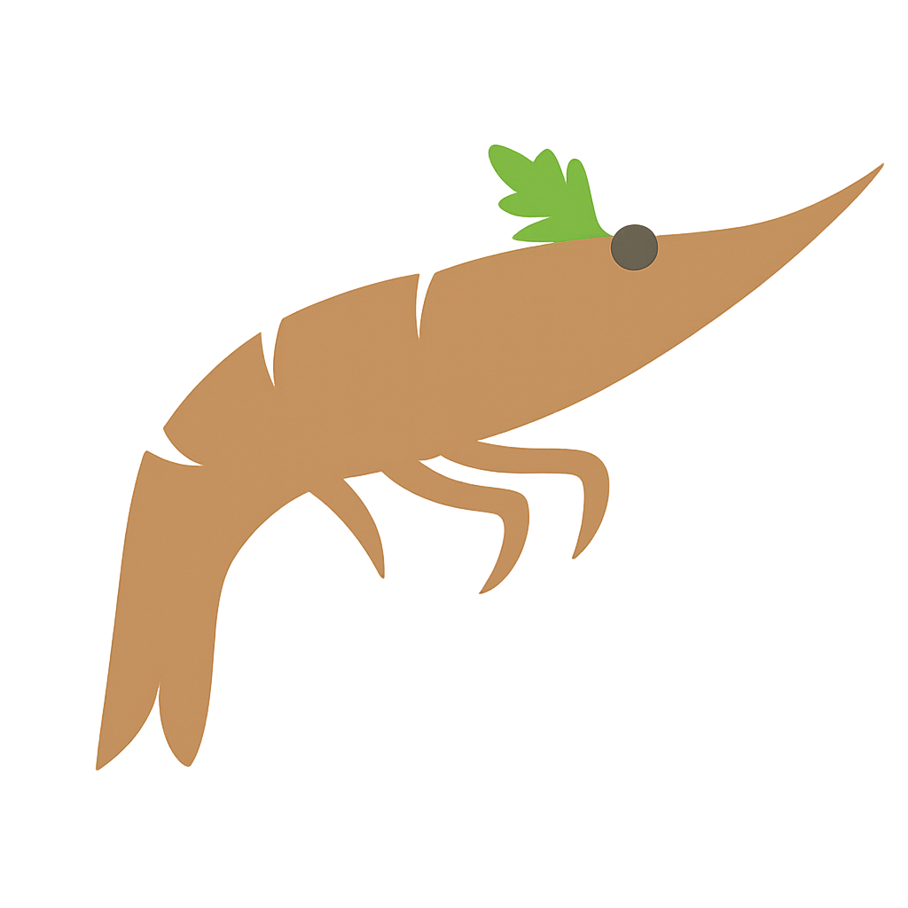

# Sea

   
  
    Parsley the Shrimp (mascot)
  

C compiler spinoff, eventually aiming for a bootstrapping compiler. Generates x86_64 AT&T and Apple ARM64 assembly.

[Claude](https://claude.ai/code)'s contributions:
* `src/preprocessor.cpp`, `src/preprocessor.h`
* `./run.sh`

## Program Flow

1. **Input**: C source code (`examples/prog.c`)
2. **Lexer**: Tokenizes source into tokens (identifiers, operators, literals)
3. **Parser**: Builds Abstract Syntax Tree using recursive descent parsing
4. **Code Generator**: Traverses AST and produces x86_64 AT&T assembly
5. **Assembly**: System calls `as` and `ld` to create executable
6. **Output**: Runnable program

Build with `make` and run `./a.out [file]` to compile a file, or `./run.sh` to run all tests.

## Adding Features

### New Node Type

1. In `src/node.h`, create a new enum type and fill out its fields in the `Node` struct.
2. In `src/parser.{h,cpp}`, implement a new function to parse this kind of node.
3. In `src/asm.{h,cpp}`, implement a new function to generate asm for this kind of node.
4. Ensure assembly generation includes the asm generation itself AND stack cleanup as you go, to prevent stack holes.
