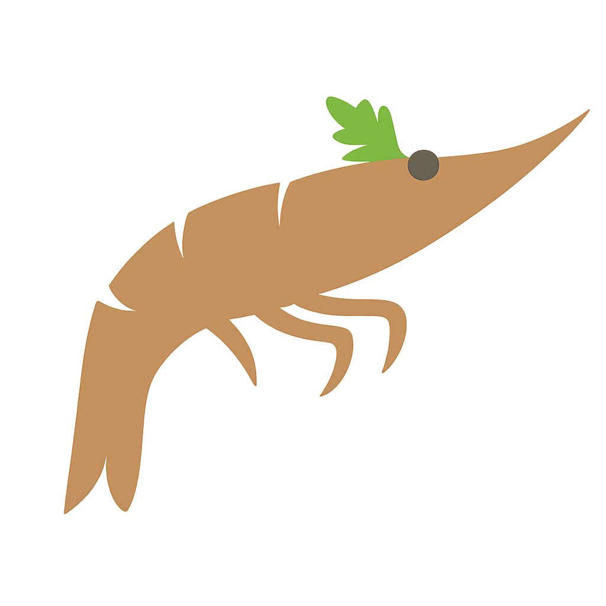

# Sea

   
  
    Parsley the Shrimp (mascot)
  

Compiler for custom language "sea". Generates x86_64 AT&T and Apple ARM64 assembly.

ChatGPT/Claude's contributions:
  * `src/preprocessor.cpp`, `src/preprocessor.h`
  * All utility shell scripts
  * A lot of `.sea` files: tests & examples & stdlib.

File structure:
  * `docs/`: demo website (compiles code in-browser) for USACO US Open Gold 2025 problems, go to https://longwatermelon.github.io/sea/.
  * `examples/`: example `.sea` implementations; USACO, Codeforces, etc.
  * `lib/`: sea standard library, written in sea.
  * `res/`: the shrimp photo
  * `src/`: sea compiler source code.
  * `tests/`: `.sea` programs & their expected output.

